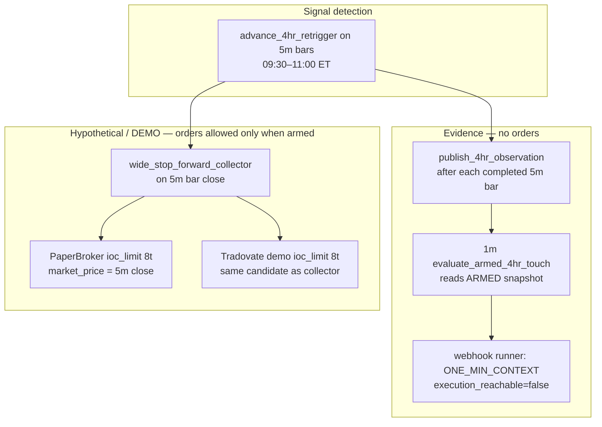

# Step 4 — DEMO prepare: 1m pre-armed vs 5m IOC wide-stop parity (2026-10-10)

**Role:** source-only QA / feasibility (Cursor builder lane). **No merge, deploy, broker orders, wiring changes, or strategy-status edits.**

**Operator decisions already fixed (do not re-run steps 2–3):**

- **Primary lead:** MNQ **4HR Re-Trigger** (broad **pre-armed touch** historical story).
- **Comparator:** MNQ **60M 3-2-2 First Live**.
- **Rejected lanes:** closed per Grok checkpoint and `docs/futures-research-resume-checkpoint-2026-10-10.md` unless new registered evidence.

**Related correctness work (separate from this doc):** #1208 / #1209 still need Grok review fixes (operator cited AFS-0212 / AFS-0213). Re-run fill-sensitive parity **after** those merge; this report cites **current** `main`-family source on branch `fix/timeframe-causal-buckets-research-20261010`.

---

## 1. Executive conclusion

| Question | Answer |
|---|---|
| Does the **existing guarded Tradovate DEMO** route test the **strongest historical 4HR lead** (1m pre-armed touch)? | **No.** DEMO and paper forward collection share **completed 5m bar detection** and **8-tick IOC at the 5m close** (paper via `PaperBroker`; demo via Tradovate `ioc_limit` override). |
| Is there already a **1m path** on the box? | **Yes — evidence only.** 1m webhooks record bars and may log **armed trigger touches**; they **never** reach DecisionEngine, RiskEngine, or broker (`execution_reachable=False`). |
| What can DEMO honestly test **without new wiring**? | Model **#2** in `docs/4hr-prearmed-touch-ab-2026-09-18.md`: **5m close IOC8**. **Production** wide-stop lane today is **300t**; **approved forward trial** on branch `research/4hr-mnq-400-forward-20261009` is **400t** — see `docs/futures-track-b-forward-readiness-2026-10-10.md`. |
| What proves **mechanism** before profitability? | Prereg `docs/prereg-forward-one-min-trigger-evidence-review-2026-09-18.md` (10 arm_keys, 20 days, 2 calendar months per strategy). **Not** DEMO P&L. |
| **DEMO-ready?** | **No.** Step 5 remains blocked: execution-model mismatch unresolved for the primary lead; forward observer calendar gates not elapsed; operator GO and independent review on open PRs. |

**Recommended operator stance:** Treat **two parallel tracks** until evidence closes the gap:

1. **Track A — Mechanism:** finish 1m observer prereg (no orders).
2. **Track B — Executable DEMO/paper:** score **5m IOC8 wide-stop** forward honestly; **do not** label results as validation of 1m pre-armed historical P&L.

Bridging Track A → Track B (orders on 1m touch) requires **explicit human approval + independent order-safety review** per `docs/agent-work-state.md`.

---

## 2. Three execution surfaces (same 4HR state machine, different entry clocks)

### 2.1 Historical “lead” (research / A/B — not runtime)

Documented in `docs/4hr-prearmed-touch-ab-2026-09-18.md` on the **same 81 MNQ 4HR candidates**:

| Model | Fills (of 81) | Net @ 1 tick (doc) | Participation note |
|---|---:|---:|---|
| Old trigger-price backfill | 80 | +$2,887 | Overstates executable edge |
| **Pre-armed stop-touch (5m bar range crosses trigger)** | 80 | +$1,415 | Conservative same-bar treatment; positive both halves @ 1–3 ticks |
| **Completed-5m close IOC8** | 37 | +$1,266 | **44 no-fill / excluded**; 38 `ENTRY_NOT_FILLED` |

The operator’s **primary lead** aligns with **pre-armed touch**, not with **IOC8 at the 5m close**.

### 2.2 Runtime paper forward collector (wide-stop lane)

| Property | Source |
|---|---|
| Trigger | `_evaluate_canonical_candidate` runs `DecisionEngine` on **completed 5m payload** inside `context/wide_stop_forward_collector.py` |
| Entry price for fill | `observe_candidate(..., market_price=float(payload.close))` → `PaperBroker.execute_bracket` with `entry_fill_model="ioc_limit"`, `entry_tolerance_ticks=8` (`context/wide_stop_ledger_runtime.py`, `context/wide_stop_ledger_paper.py`) |
| Lane risk overlay | `wide_stop_4k`: **300** max stop ticks, **1.0** min R:R (`context/wide_stop_ledger_paper.py`) |
| 4HR observation file | Published **on the same 5m bar** when machine state non-empty; `source_timestamp = bar_close + 5m` (`publish_4hr_observation`) — **feeds 1m observer only** |
| Invoked from | `context/five_min_feed.py` when `FIVE_MIN_FEED_ENABLED` and `WIDE_STOP_LEDGER_MODE=paper_sim` |

### 2.3 Runtime Tradovate DEMO (additive, fail-closed)

| Property | Source |
|---|---|
| Bar clock | Same **5m** ingestion as paper (`process_demo_five_min_bar` in `context/wide_stop_demo_runtime.py`) |
| Candidate detection | Reuses `collector._evaluate_canonical_candidate` (`context/wide_stop_demo_runtime_core.py`) |
| Entry mode | `DEMO_ENTRY_EXECUTION_MODE = "ioc_limit"`, `FROZEN_MNQ_IOC_TICKS = 8` via `BracketOrder.entry_execution_mode_override` (`context/wide_stop_execution.py`) |
| Arming | Separate env proof pins: `WIDE_STOP_DEMO_EXECUTION_ENABLED` + `EXPECTED_PROOF_*`; lane-local schedule mode; **does not** read global `SCHEDULE_MODE` |
| Storage | Isolated under `tradovate_demo_evidence/` (no blend with paper journal) |

### 2.4 Runtime 1m armed-touch observer (mechanism only)

| Property | Source |
|---|---|
| Ingress | `webhook/runner.py` Step 0a0: if `one_min_enabled()` and 1m timeframe → `record_one_min`, optional `evaluate_armed_4hr_touch`, then **return** with `decision=ONE_MIN_CONTEXT`, **`execution_reachable=False`** |
| Preconditions | `ONE_MIN_4HR_OBSERVER_ENABLED` **and** generic 1m lane on (`context/four_hr_observation.py`, `context/one_min_trigger.py`) |
| Touch logic | First 1m bar whose range crosses **published** ARMED `trigger`; stop from **last fully completed 1H bar before bar open** (`_fully_completed_one_hour_stop`) |
| Authority flags on snapshot | `executable: false`, `trade_authorized: false`, `order_authority: false` (`four_hr_observation.py`) |
| Prereg gates | `docs/prereg-forward-one-min-trigger-evidence-review-2026-09-18.md` |

**Critical ordering detail:** Observation publish happens at **5m bar processing**; 1m touch can occur **inside** the triggering 5m period **before** the bar closes. The collector **cannot** enter on that intrabar touch; it only evaluates at **close** with IOC from **close** price.

---

## 3. Parity matrix (what matches, what cannot)

| Dimension | 1m pre-armed observer | 5m IOC paper / DEMO | Match? |
|---|---|---|---|
| 4HR setup / state machine | Indirect (ARMED snapshot from collector walk) | Direct `DecisionEngine` + `advance_4hr_retrigger` | **Partial** — same machine, different **decision time** |
| Trigger time | First 1m cross of armed level | First **TRADE** decision at **5m close** | **No** |
| Entry price model | Evidence row (not a broker fill) | IOC limit ±8 ticks from **5m close** | **No** |
| Stop anchor (causal 1H) | Explicit in 1m module | Strategy setup at 5m decision (A/B doc: 2 dates differ vs intrabar causal stop) | **Risk: No** on some bars — see A/B §Timing |
| Global book `$1,500` stop cap | N/A (no trade) | Overridden only on wide-stop ledger (`stop_too_wide` / `rr_below_minimum`) | N/A |
| Wide-stop caps | N/A | 300t / 1.0 R:R (4HR) | N/A |
| Broker path | None | PaperBroker vs Tradovate demo | N/A |
| Profitability claim | **Not allowed** (observer prereg) | Forward P&L is **5m IOC8** story | **Do not interchange** |

---

## 4. Feasibility options (no recommendation to wire without approval)

### Option A — Keep DEMO on 5m IOC8 (status quo)

- **Pros:** Already implemented, guarded, tested (`tests/test_wide_stop_demo_runtime.py`); aligns with A/B model #2 and research-branch forward prereg intent.
- **Cons:** **Under-fills** vs pre-armed historical lead (~37 vs ~80 fills on fixed population); H1/H2 P&L profile differs from pre-armed; operator primary lead is **not** what DEMO measures.

### Option B — Complete 1m observer prereg, still no DEMO orders

- **Pros:** Closes mechanism proof gap; uses existing files under `tf1m/`; fail-closed if runtime pins drift.
- **Cons:** Does not produce tradable DEMO evidence; calendar gates (2 months) take time.

### Option C — New DEMO entry path: 1m touch → Tradovate (not implemented)

- **Would require:** New prereg, risk review, proof pins, parity tests vs observer, explicit stop-at-trigger-time rules, and likely #1208-style fill honesty for any research replay.
- **Out of scope for Step 4** without operator GO.

### Option D — Express 4HR via ETF options (Claude branch)

- Separate lane; see `docs/futures-research-resume-checkpoint-2026-10-10.md` appendix. Does **not** resolve futures DEMO mismatch.

---

## 5. Step 4 checklist (this session)

| Item | Status |
|---|---|
| Read wide-stop paper + demo + 1m observer sources | **Done** (this doc) |
| Document execution mismatch vs primary lead | **Done** |
| Cite prior quantitative A/B (IOC8 vs pre-armed) | **Done** (doc ref; not re-run) |
| Identify honest DEMO testable hypothesis | **Done** — 5m IOC8 wide-stop |
| Identify mechanism proof path | **Done** — 1m observer prereg |
| VPS / deploy / box posture verification | **Not done** (operator or restricted read-only pass) |
| Re-run fill parity after #1208/#1209 | **Pending** merges |

---

## 6. Exact next actions (post–Step 4)

**Operator / ChatGPT (lead):**

1. Review #1210 / #1211 at exact heads (CI green at last check); land Grok fixes on #1208 / #1209 before trusting fill-sensitive replays.
2. Choose **Track A**, **Track B**, or **both** explicitly in PR #1201 / checkpoint (no implicit “DEMO validates 4HR lead”).
3. Withhold deploy of research forward SHA until execution story is written into operator GO.

**Cursor (if continued):** After #1208 merge, optional **minimal** replay script comparing collector IOC8 outcomes to archived pre-armed A/B rows — **read-only**, no new parameters.

**Claude/Codex:** Attack demo isolation, pending-order reconcile, and 1m/5m timestamp ordering on the cited modules.

**Grok:** Do **not** re-open closed ORB/VWAP grids; new causal 4HR **failure-mode** hypotheses only, prereg format.

---

## 7. References

| Artifact | Purpose |
|---|---|
| `docs/4hr-prearmed-touch-ab-2026-09-18.md` | Quantitative IOC8 vs pre-armed on fixed 81 candidates |
| `docs/prereg-forward-one-min-trigger-evidence-review-2026-09-18.md` | Forward 1m mechanism gates |
| `docs/wide-stop-hypothetical-ledger-lane-spec-2026-09-07.md` | Lane caps, IOC8, isolation |
| `docs/agent-work-state.md` | Step 4 blockers, agent split |
| `docs/futures-research-resume-checkpoint-2026-10-10.md` | Grok + Cursor + Claude appendices |
| Branch `research/4hr-mnq-400-forward-20261009` | 400-tick forward prereg + saved benchmark (5m IOC story) |
