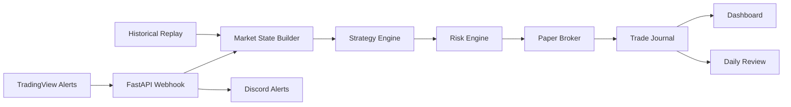

# Build a Paper-Trading Automation System

## Course Overview

Build a complete, paper-only trading operations system that receives market alerts, evaluates rule-based setups, enforces strict risk limits, simulates bracket orders, journals every decision, and displays system health through a dashboard.

This is not a course about finding a guaranteed profitable strategy. It is a practical engineering course about building safe, testable, and auditable trading automation.

Students finish with a working system they understand from end to end.

---

## What Students Build

The completed project can:

- Receive authenticated TradingView webhook alerts
- Validate and normalize incoming market data
- Generate deterministic `TRADE` or `NO_TRADE` decisions
- Enforce daily trade limits, session rules, minimum R:R, and other safeguards
- Simulate bracket orders without risking real money
- Record every decision and outcome in an auditable journal
- Replay historical candle data through the same decision pipeline
- Send Discord notifications
- Display risk, strategy, webhook, and position status in a dashboard
- Run locally or on a cloud server

---

## Who This Is For

This course is designed for:

- Traders who want to understand how automation systems actually work
- Python developers interested in trading-system architecture
- TradingView users who want to do more with Pine alerts
- Builders who want a safe foundation before exploring broker integrations
- Students who learn best by completing a real end-to-end project

This course is not designed for people looking for guaranteed returns, copy-trading signals, or instant live-trading automation.

---

## Prerequisites

Recommended:

- Basic understanding of trading terms such as entry, stop, target, and risk/reward
- Basic computer and file-management skills
- Willingness to use the command line

Helpful but not required:

- Beginner Python knowledge
- Basic Git/GitHub knowledge
- TradingView experience

The course introduces the required Python, JSON, HTTP, webhook, and testing concepts as they are used.

---

## Course Format

| Track | Best For | Expected Time |
|---|---|---:|
| Operator | Configure and operate the provided system | 8-12 hours |
| Builder | Build and understand each core module | 25-40 hours |
| Advanced | Add deployment, databases, AI review, and broker adapters | 40-60+ hours |

Each module includes:

- Short concept lessons
- Guided implementation
- A practical assignment
- Tests or verification steps
- A concrete project deliverable

---

## Core Principles

### Paper First

The course starts and finishes safely in paper mode. Live execution is not required.

### Risk Is Independent

The strategy engine may suggest a trade. The risk engine independently decides whether the system is allowed to take it.

### Deterministic Before Intelligent

The core decision and risk path uses explicit, testable rules. AI may review journals and create summaries, but it does not override risk controls.

### Every Decision Is Auditable

Approvals, rejections, inputs, reasons, simulated fills, and outcomes are recorded.

### Replay Before Trust

Changes are tested against historical candles before being trusted during live market hours.

---

## Technology Stack

| Layer | Primary Technology |
|---|---|
| Market alerts | TradingView Pine and webhooks |
| Backend | Python and FastAPI |
| Strategy and risk | Deterministic Python modules |
| Execution | Paper broker abstraction |
| Storage | JSONL journal, with optional SQLite/Postgres expansion |
| Notifications | Discord webhooks |
| Dashboard | FastAPI HTML/JavaScript, with optional React/Next.js expansion |
| Testing | Pytest and historical replay |
| Deployment | Local machine, Railway, or VPS |

---

## Capstone

The final capstone is a deployed paper-trading operations system.

To complete the capstone, the system must:

1. Receive and authenticate an alert
2. Reject malformed or stale data
3. Produce a documented strategy decision
4. Apply independent risk checks
5. Simulate an approved bracket order
6. Journal approvals and rejections
7. Display current status on the dashboard
8. Send a notification
9. Pass automated tests
10. Complete a historical replay without crashing

---

## Estimated Student Costs

| Setup | Estimated Monthly Cost |
|---|---:|
| Local learning and replay | $0-$20 |
| TradingView paper-alert setup | $15-$80 |
| Deployed paper system | $30-$120 |
| Broker-simulation or live-ready expansion | $50-$200+ |

Python, FastAPI, Pytest, JSONL storage, and the core course project are open-source. Paid costs mainly come from TradingView plans, hosting, domains, market data, and optional broker services.

Real trading capital is separate and is not required for the course.

---

## Safety and Disclaimer

This course and its software are for educational and paper-trading purposes. They do not provide financial advice, promise profitability, or guarantee system reliability.

Trading futures and other leveraged products involves substantial risk. Live broker execution should be treated as a separate advanced project requiring additional testing, monitoring, permissions, safeguards, and professional review.

---

## Student Outcome

By the end of the course, students will understand how data, strategy logic, risk controls, execution, journaling, replay, notifications, dashboards, and deployment work together inside a trading automation system.

More importantly, they will leave with a working system that makes its decisions visible, testable, and accountable.

