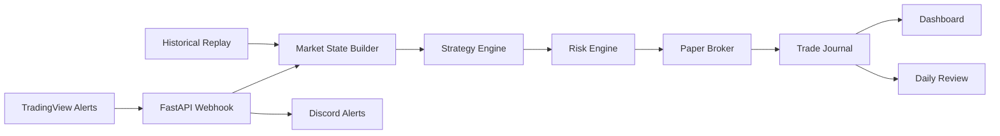

# Build a Paper-Trading Automation System

Build a complete, **paper-only** trading operations system: it receives market
alerts, evaluates rule-based setups, independently enforces risk limits,
simulates bracket orders, journals every decision, replays history, and shows
system health on a dashboard.

This is an engineering course, not a get-rich strategy. No profitability is
promised and live trading is never required. You finish with a working system
you understand end to end.

> Full curriculum, stack options, and costs → **[COURSE_GUIDE.md](COURSE_GUIDE.md)**

## The pipeline you build

The finished system authenticates webhook alerts, validates data, makes
deterministic `TRADE`/`NO_TRADE` decisions, enforces risk rules independently,
simulates bracket orders, journals every decision, replays historical candles
through the same pipeline, sends notifications, and runs locally or on a VPS.

## Who it's for

Traders who want to know how automation actually works, Python developers
curious about trading-system architecture, and anyone who learns by completing a
real end-to-end project. **Not** for people seeking guaranteed returns or instant
live-trading bots.

**Prerequisites:** basic trading terms (entry/stop/target/RR) and comfort with
the command line. Beginner Python and Git help but aren't required — the course
introduces what it uses.

## Tracks

| Track | You... | Time |
|---|---|---:|
| Operator | Configure, test, deploy, and run the supplied system | 8–12 h |
| Builder | Implement and understand each module | 25–40 h |
| Advanced | Add deployment, databases, AI review, broker adapters | 40–60+ h |

## Stack at a glance

| Layer | Technology |
|---|---|
| Alerts | TradingView Pine + webhooks |
| Backend | Python + FastAPI |
| Strategy & risk | Deterministic Python modules |
| Execution | Paper broker (no real money) |
| Storage | JSONL journal (→ optional SQLite/Postgres) |
| Notifications | Discord webhooks |
| Dashboard | FastAPI HTML/JS (→ optional React/Next.js) |
| Testing | Pytest + historical replay |
| Hosting | Local, Railway, or VPS |

## Cost tiers (monthly)

| Tier | Cost | Includes |
|---|---:|---|
| Learning / local | $0–$20 | Local app, sample alerts, replay |
| Paper TradingView | $15–$80 | TradingView alerts, tunnel, Discord |
| Deployed paper | $30–$120 | VPS/Railway, domain, monitoring |
| Broker-sim / live-ready | $50–$200+ | Broker tools, data, commissions |

The core stack is open source; paid cost is mostly TradingView, hosting, and
optional data/broker services. Real trading capital is separate and not required.

## Capstone

Demonstrate one full paper-trading day — ingest → validate → decide → risk-check
→ paper-fill → journal → notify → dashboard → replay → tests — all in paper mode.
Full checklist and grading in **[COURSE_GUIDE.md](COURSE_GUIDE.md)**.

---

*Educational / paper-trading only. Not financial advice; no guarantee of
profitability or reliability. Live brokerage execution is a separate advanced
project requiring additional safeguards, testing, and review.*
